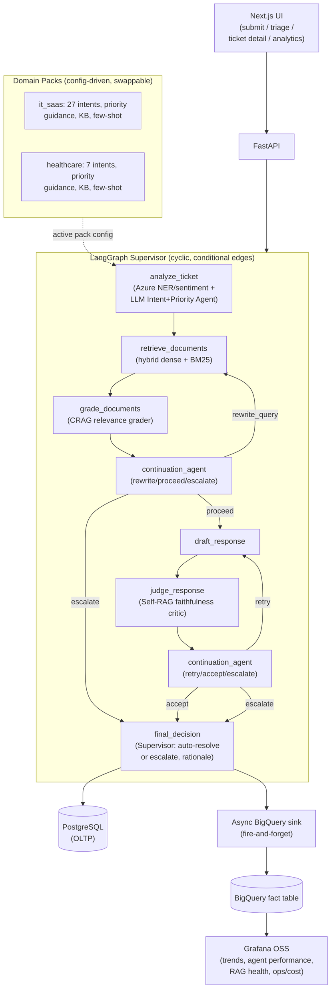

# Agentic Multi-Cloud Ticket Resolution

An agentic support-ticket resolution system: a cyclic [LangGraph](https://github.com/langchain-ai/langgraph) of six
LLM agents (intent/priority classification, CRAG document grading, Self-RAG response judging, and an agentic
Continuation Agent that replaces every fixed retry-cap/threshold with a reasoned decision), running against two
real, labeled domain packs (IT/SaaS and Healthcare), with a from-scratch evaluation harness, a BigQuery/Grafana
analytics layer, and a Next.js UI — all runnable for free on a laptop via Docker Compose.

This is a rebuild of an earlier keyword-heuristic pipeline. See [Why this rebuild](#why-this-rebuild) for what
changed and why, and [Evaluation](#evaluation) for how "agentic, not guessed" is actually measured rather than
asserted.

## Table of contents

- [Architecture](#architecture)
- [Why this rebuild](#why-this-rebuild)
- [Domain packs](#domain-packs)
- [Running locally](#running-locally)
- [Evaluation](#evaluation)
- [Analytics (BigQuery + Grafana)](#analytics-bigquery--grafana)
- [Frontend](#frontend)
- [CI/CD](#cicd)
- [Project structure](#project-structure)
- [Multimodal: considered and rejected](#multimodal-considered-and-rejected)
- [Extending with a new domain pack](#extending-with-a-new-domain-pack)

## Architecture



Every box that makes a judgment call is an LLM call against the active domain pack's taxonomy and few-shot
examples — there is no keyword dictionary, fixed confidence formula, or hardcoded retry counter anywhere in the
decision path. See [`app/agents/supervisor.py`](app/agents/supervisor.py) for the actual graph wiring.

| Agent | File | Real work it does |
|---|---|---|
| Azure NLP | [`app/agents/azure_nlp_agent.py`](app/agents/azure_nlp_agent.py) | Real Azure Text Analytics calls for entity extraction, sentiment, key phrases. No intent/priority logic — that's fully LLM-owned now. |
| Intent + Priority | [`app/agents/intent_priority_agent.py`](app/agents/intent_priority_agent.py) | LLM classifies intent + priority against the active pack's taxonomy, with self-consistency sampling and a rationale. |
| Retrieval | [`app/agents/retrieval_agent.py`](app/agents/retrieval_agent.py) | Hybrid dense (Pinecone) + sparse (BM25) candidate retrieval, chunked 200–500 words with overlap. No similarity-score cutoff — grading is the real filter. |
| Document Grader (CRAG) | [`app/agents/document_grader.py`](app/agents/document_grader.py) | Per-document relevance grading + query rewriting on retry. |
| Drafting | [`app/agents/drafting_agent.py`](app/agents/drafting_agent.py) | Generates the response from graded-relevant context. No hand-rolled confidence formula — confidence comes only from the Judge. |
| Judge (Self-RAG) | [`app/agents/judge_agent.py`](app/agents/judge_agent.py) | Faithfulness + relevance critique of the draft against only the graded-relevant documents. |
| Continuation Agent | [`app/agents/continuation_agent.py`](app/agents/continuation_agent.py) | Reads the full trace and decides `rewrite_query` / `proceed` / `retry` / `accept` / `escalate`. |
| Supervisor | [`app/agents/supervisor.py`](app/agents/supervisor.py) | Owns the LangGraph state machine; `final_decision` is itself an LLM call reasoning over the whole trace, not a hardcoded boolean check. |

Shared infrastructure: [`app/llm/ollama_client.py`](app/llm/ollama_client.py) wraps every Ollama call with
structured-output validation (Pydantic schema + retry-on-malformed-output) and per-role model configuration
(`model_intent_priority`, `model_grader`, `model_judge`, `model_continuation`, `model_drafting`,
`model_supervisor` in [`app/config.py`](app/config.py)) — so any single role's model can be swapped independently
once an eval run shows it needs a stronger model.

**Engineering safety net, not a business rule**: `max_iterations` and `max_wall_clock_seconds`
(`app/config.py`) put a hard ceiling on worst-case cost/latency if a bug causes runaway looping. Trips are logged
as anomalies and surfaced on the ops/cost Grafana dashboard — they never influence what an agent decides, only
guarantee the system can't run forever.

## Why this rebuild

Researched during planning: commercial agentic support platforms (Decagon, Sierra, Intercom Fin, Ada, Forethought)
report 65–85% autonomous resolution in 2026, driven primarily by knowledge-base quality and retrieval accuracy,
not model choice. Open-source reference implementations (`saqiba123/Support-Ticket-Resolution-Agent-with-Multi-Step-Review-Loop`,
`PrAtHaM-0707/Agentic-Support-AI`, `Sari95/langgraph-multi-agent-ticket-triage`) all use a **fixed retry counter**
for their review loop, and none combine per-document relevance grading (CRAG) + faithfulness critique (Self-RAG)
+ feedback-injected retry (Reflexion) + an agentic continuation decision in one graph.

What the original version of this repo had instead: keyword-dictionary intent classification, a hardcoded
`min_similarity = 0.65` retrieval cutoff, a hand-rolled confidence formula, and a fixed escalation threshold — none
of which reasoned over the actual content of a ticket. The rebuild replaces all of that with the agent table above,
plus a real evaluation harness (below) so "agentic" is a measured property, not a marketing claim.

## Domain packs

Two domain packs ship under [`domains/`](domains/), each fully config-driven — no code changes needed to add a
third:

- **`it_saas`** — 27 real, human-authored intents across 10 categories (accounts, orders, billing, refunds,
  shipping, subscriptions, feedback), sourced from the
  [Bitext customer-support LLM chatbot training dataset](https://huggingface.co/datasets/bitext/Bitext-customer-support-llm-chatbot-training-dataset)
  (26,872 real rows; 3,400 sampled for pipeline build speed — see `domains/it_saas/config.yaml`'s
  `source_dataset.limitations`). `intent_eval_available: true` — the held-out test set has real labels, so
  intent-classification F1 is a genuine number (see [Evaluation](#evaluation)).
- **`healthcare`** — a 7-intent taxonomy (new_patient_inquiry, appointment_request, billing_inquiry,
  clinical_concern, complaint, price_shopper, existing_patient_question). `intent_eval_available: false` —
  documented explicitly in `domains/healthcare/config.yaml` because the source data doesn't carry the same kind
  of clean intent labels; rather than fabricate a score, `eval/intent_priority_eval.py` reports this pack's
  intent metric as `"available": false` with the reason stated. A separate, real signal — priority vs. the
  source dataset's actual `star_rating` field — is measured instead (`evaluate_healthcare_priority_correlation`
  in `eval/agreement_eval.py`).

Each pack directory contains:
- `config.yaml` — intent taxonomy, priority guidance (advisory prose fed to the LLM, never a hardcoded rule), KB
  category map, source-dataset provenance/limitations.
- `few_shot_examples.json` — real examples used in agent prompts.
- `kb/` — knowledge-base articles indexed into a pack-specific Pinecone namespace by
  [`seed_kb.py`](seed_kb.py).

Loaded and validated by [`app/domain/loader.py`](app/domain/loader.py) /
[`app/domain/schema.py`](app/domain/schema.py); selected per-request via `domain_pack` on ticket submission, or
globally via the `DOMAIN_PACK` env var.

## Running locally

Everything below is free and runs entirely on your machine.

### Option A — Docker Compose (recommended)

Brings up Postgres, Ollama (auto-pulls the configured model), the FastAPI backend, the Next.js frontend, and
Grafana in one command.

```bash
cp .env.example .env
# Fill in the two real managed-service credentials Docker Compose can't
# stand up locally (see "What Docker Compose does NOT provide" below):
#   AZURE_TEXT_ANALYTICS_ENDPOINT / AZURE_TEXT_ANALYTICS_KEY
#   PINECONE_API_KEY / PINECONE_ENVIRONMENT

docker compose up --build
```

- Backend API: http://localhost:8000/docs
- Frontend: http://localhost:3000
- Grafana: http://localhost:3001 (admin/admin by default; anonymous viewer access is also enabled for the
  frontend's embedded analytics page)

Then seed the knowledge base into Pinecone (one time, per pack):

```bash
docker compose exec backend python seed_kb.py --pack it_saas
docker compose exec backend python seed_kb.py --pack healthcare
```

**What Docker Compose does *not* provide**, because they're real external managed services, not something
Compose can stand up locally: Azure Text Analytics (real NLP signals) and Pinecone (vector storage). Both have
free tiers — see their signup pages. BigQuery analytics is also opt-in and off by default (`ENABLE_BIGQUERY=false`).

### Option B — Native Python (no Docker)

```bash
python3 -m venv venv && source venv/bin/activate
pip install -r requirements.txt

cp .env.example .env   # fill in Azure/Pinecone credentials; point OLLAMA_BASE_URL/DATABASE_URL at your own instances

# Ollama running natively:
ollama serve &
ollama pull qwen2.5:3b

python app/db/init_db.py
python seed_kb.py --pack it_saas
uvicorn app.api.main:app --reload
```

### Running tests

```bash
pytest tests/ -v
```

50 tests, all fully mocked (Ollama, Azure, Pinecone, BigQuery — see `tests/conftest.py`) so they run in a few
seconds with zero live credentials or network access.

## Evaluation

`eval/` measures each agent that makes a judgment call:

| Script | Metric | What it measures |
|---|---|---|
| [`eval/intent_priority_eval.py`](eval/intent_priority_eval.py) | Macro-F1, precision, recall | `IntentPriorityAgent` against each pack's held-out labels. Packs without labels report `"available": false`. |
| [`eval/ner_eval.py`](eval/ner_eval.py) | Entity-level P/R/F1 (`seqeval`) | Azure NER against a CoNLL gold file when `--gold-file` is provided. |
| [`eval/rag_eval.py`](eval/rag_eval.py) | Faithfulness, answer relevancy (`ragas`) | Retrieval + drafting quality via a local Ollama judge and `all-MiniLM-L6-v2` embeddings. |
| [`eval/agreement_eval.py`](eval/agreement_eval.py) | Cohen's kappa; Spearman correlation | Supervisor escalate/auto-resolve vs human labels (`eval/human_review/`). Also correlates healthcare priority with `star_rating`. |
| [`eval/run_eval.py`](eval/run_eval.py) | Orchestrator + CI gate | Runs the above, compares to `eval/report_baseline.json`, fails on regression. |

```bash
python eval/run_eval.py                        # run + compare to baseline
python eval/run_eval.py --update-baseline       # run + overwrite the baseline with current real numbers
python eval/run_eval.py --skip-rag              # skip ragas (needs a live Ollama + seeded Pinecone)
python eval/run_eval.py --pack it_saas          # single pack instead of all
```

**Baseline**: `eval/report_baseline.json` starts empty. Populate it with
`python eval/run_eval.py --update-baseline` against a live Ollama + seeded
Pinecone setup. CI treats a missing baseline as non-fatal.

**Human review loop**: `eval/human_review/review_template.csv` + `eval/human_review/README.md` document how to
manually adjudicate "should this ticket have been escalated" on a sample of real tickets, which is what
`agreement_eval.py`'s Cohen's kappa is computed against.

## Analytics (BigQuery + Grafana)

[`app/analytics/bigquery_sink.py`](app/analytics/bigquery_sink.py) is an async, fire-and-forget sink
(`insert_rows_json`, not the Storage Write API — unnecessary complexity at this volume) called from the
Supervisor's `final_decision` node. It never blocks or fails ticket resolution — exceptions are caught and
logged, not raised. Opt-in via `ENABLE_BIGQUERY=true`; uses BigQuery's free sandbox tier (10GB storage, 1TB
query/month, no billing account required).

Schema: `fact_ticket_events`, partitioned by `DATE(event_ts)`, clustered by `category, priority` — every trace
field from the graph (iteration count, judge scores, escalation rationale, cost estimate, domain pack) plus
latency/model metadata per agent call.

Four Grafana dashboards are provisioned automatically (`grafana/dashboards/`, wired up via
`grafana/provisioning/`) once BigQuery is enabled and Grafana is given real service-account JWT credentials (see
`grafana/README.md`):

- **`ticket-trends.json`** — volume by domain pack/priority, 7-day rolling escalation rate.
- **`agent-performance.json`** — confidence distributions, escalation rate, intent self-consistency.
- **`rag-health.json`** — faithfulness/relevance trend, retrieval-miss rate, relevant/candidate ratio.
- **`ops-cost.json`** — iterations, LLM calls/tokens, latency percentiles, safety-net trip counts.

## Frontend

`frontend/` is a Next.js 15 (App Router) + Tailwind app calling the FastAPI backend directly:

- **`/submit`** — ticket submission form (domain-pack selector, title/description), shows the immediate
  processing result.
- **`/triage`** — ticket queue with domain/priority/status/escalation filters.
- **`/tickets/[id]`** — full agentic trace view: per-document CRAG grading rationale, judge scores per
  iteration, continuation rationale at every branch point, and the final Supervisor rationale. This is the
  project's best demonstration piece — the whole point of the rebuild is that every decision has a reasoned
  trace, and this page renders exactly that trace, not a summary of it.
- **`/analytics`** — embeds the Grafana dashboards above via iframe.

```bash
cd frontend
npm install
npm run dev   # http://localhost:3000, expects the backend at NEXT_PUBLIC_API_URL (default http://localhost:8000)
```

## CI/CD

[`.github/workflows/ci.yml`](.github/workflows/ci.yml) runs on every push/PR to `main`, four sequential jobs:

1. **Lint** — `ruff check .` (config in `pyproject.toml`).
2. **Test** — `pytest tests/` with mocked cloud clients (see `tests/conftest.py`) — no real credentials needed.
3. **Eval gate** — installs real Ollama on the runner, pulls `qwen2.5:3b`, and runs
   `eval/run_eval.py --pack all --skip-rag` — a genuine LLM evaluation, not a mock, gated against
   `eval/report_baseline.json`. `--skip-rag` is the one metric family skipped in CI, since `ragas` additionally
   needs a seeded Pinecone index with no free ephemeral CI equivalent; that gap is reported honestly by
   `eval/rag_eval.py`, not faked.
4. **Build** — builds both the backend and frontend Docker images (no push).

A separate, optional Terraform plan/Checkov workflow for `infra/` (targeting only free-tier-eligible resources)
is intentionally not wired up as a merge-blocking gate, since the Terraform path itself is now optional/legacy —
see [`infra/README.md`](infra/README.md).

## Project structure

```
app/
├── agents/            # 8 agents — see the table in Architecture above
├── analytics/         # Async BigQuery sink
├── api/
│   ├── main.py         # FastAPI app, CORS
│   └── routes/         # tickets.py, health.py
├── db/                 # SQLAlchemy models/session/init
├── domain/             # Domain-pack loader + schema
├── embeddings/         # SentenceTransformers + chunking + Pinecone client
├── llm/                # Shared Ollama client (structured output, per-role models)
├── schemas/            # Pydantic request/response schemas
└── config.py           # Central Pydantic settings

domains/                # it_saas/, healthcare/ — config.yaml, few-shot examples, KB
eval/                   # Evaluation harness — see Evaluation above
frontend/               # Next.js UI
grafana/                # Dashboards + provisioning
infra/                  # Optional/legacy Terraform (see infra/README.md)
tests/                  # 50 tests, fully mocked external services
docker-compose.yml      # Full local stack: postgres, ollama, backend, frontend, grafana
```

## Multimodal: considered and rejected

Image and voice input were researched and explicitly rejected for this build. The "real" image datasets found
(`ImageR` Bugzilla screenshots, `SROIE` receipts) don't actually pair with ticket text — using them would mean
synthetically stapling unrelated data together, which conflicts with the no-guessing/no-fabrication standard
applied everywhere else in this rebuild (see [Evaluation](#evaluation)). Voice has real transcripts
(`CallCenterEN`) but no free raw audio to evaluate speech-to-text on this domain. If a real, paired
multimodal ticket dataset surfaces, this is the first place to revisit — not before.

## Extending with a new domain pack

1. Create `domains/<your_pack>/config.yaml` following `domains/it_saas/config.yaml`'s shape: intent taxonomy,
   priority guidance (prose, not rules), KB category map, and `source_dataset` provenance (including honest
   `limitations`).
2. Add `domains/<your_pack>/few_shot_examples.json` and `domains/<your_pack>/kb/*.json` (or similar) knowledge
   base articles.
3. If you have labeled ground-truth intents, add `eval/datasets/<your_pack>_test.jsonl` and set
   `intent_eval_available: true`; otherwise set it to `false` with a `limitations` string explaining why — see
   `domains/healthcare/config.yaml` for the pattern.
4. `python seed_kb.py --pack <your_pack>` to index the KB into its own Pinecone namespace.
5. `python eval/run_eval.py --pack <your_pack>` to get real numbers before shipping it.

No code changes required — the agents, graph, and eval harness are all pack-agnostic by construction.
